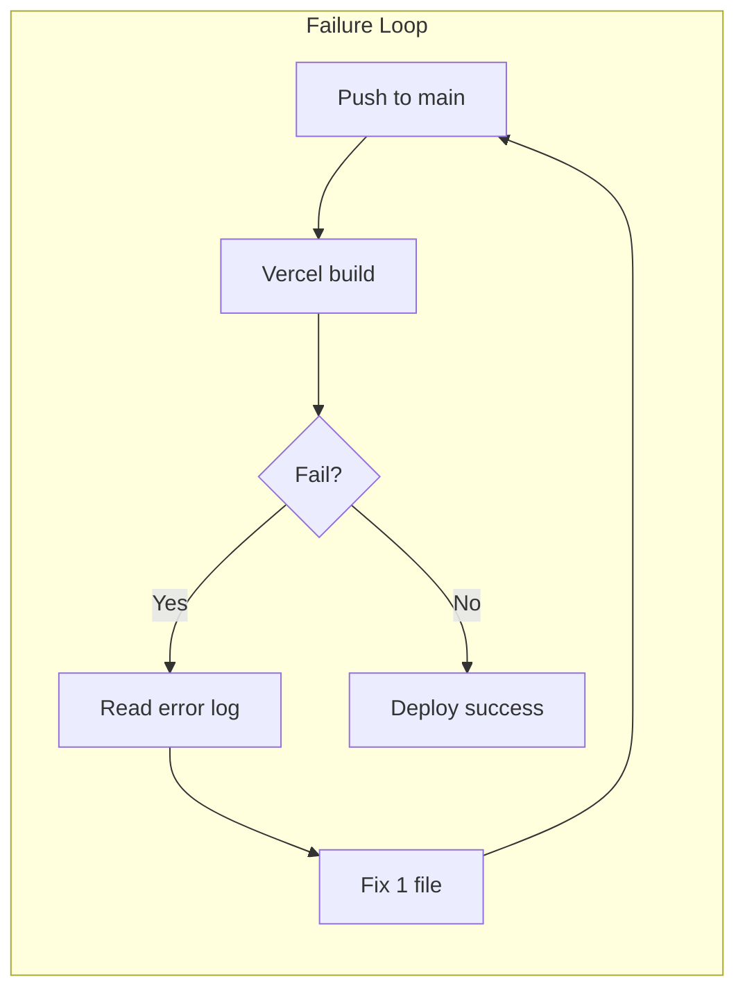
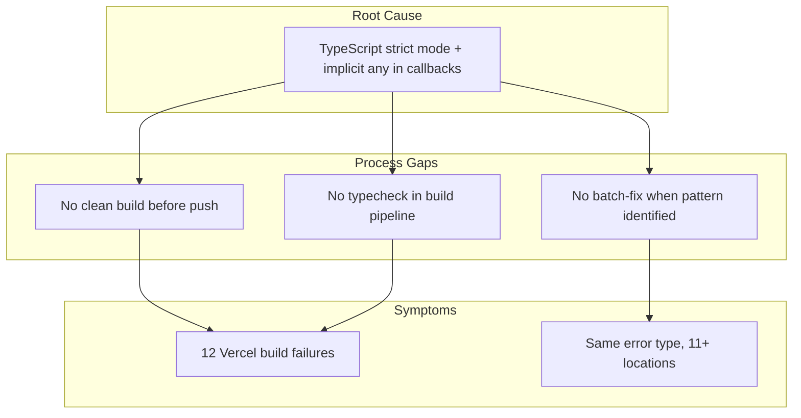

# Architecture Review: Vercel Build Failure Analysis & Debugging Process

Architect review of the 12-cycle Vercel build failure, root-cause analysis of the "junior dev" approach, and a production-ready checklist to prevent recurrence.

---

## Part 1: What Went Wrong (The "Junior Dev" Pattern)

### The Reactive Loop



**12 cycles occurred because:**

| Mistake | What Happened | Correct Approach |
|---------|---------------|------------------|
| **Fix-one-at-a-time** | TypeScript reports only the first error. Each push revealed the next. | Fix all errors in one pass by reproducing locally first. |
| **Trusted incremental build** | `npm run build` with existing `.next` cache can skip re-type-checking unchanged files. | Run `rm -rf .next && npm run build` to match Vercel's clean build. |
| **No pattern search** | Fixed `profile/page.tsx` `.some()` but did not grep for other `.some((r) =>` / `.map((x) =>` across the codebase. | First fix = signal to search entire codebase for same pattern. |
| **Ignored existing tooling** | `npm run build:clean` and `npm run typecheck` existed but were not used before push. | Make clean build mandatory in workflow. |
| **Reactive debugging** | Waited for Vercel to fail, then fixed. | Proactive: reproduce failure locally, then fix all before push. |

### Root Cause Hierarchy



**Technical root cause:** `strict: true` in `tsconfig.json` + untyped callback params in `.map()`, `.some()`, `$transaction`. Vercel runs a **fresh** build; local incremental builds can skip these.

**Process root cause:** No guardrail forcing a Vercel-equivalent build before push.

---

## Verification Workflow (Before Every Production Push)

Run this single command. **Exit 0 = production ready. Non-zero = fix, then repeat.**

```bash
npm run verify:production
```

- If **exit 0** → safe to push. Vercel build will succeed.
- If **exit 1** → fix the reported errors (and search for similar patterns), then run again until pass.

`verify:production` runs: `typecheck` → `lint` → `rm -rf .next` → `build`. This matches what Vercel does (clean build) plus typecheck and lint guards.

---

## Part 2: Production Build Debugging Process (Checklist)

### Phase A: Before Every Production Push

| Step | Command / Action | Rationale |
|------|------------------|-----------|
| 1 | `npm run verify:production` | Single command: typecheck + lint + clean build. Matches Vercel. |
| 2 | If it fails: do **not** push. Fix all reported errors. | Prevents the one-error-per-deploy cycle. |
| 3 | When fixing: grep for similar patterns. Example: `rg "\.(map|some|filter)\(\([a-z]+\) =>" -g "*.{ts,tsx}"` | One fix often implies 5–10 similar fixes. |

### Phase B: When Vercel Build Fails (Reactive)

| Step | Action |
|------|--------|
| 1 | Copy the full error (file, line, parameter). |
| 2 | Run `rm -rf .next && npm run build` locally. Confirm you see the same error. |
| 3 | Fix the reported error. |
| 4 | **Critical:** Search codebase for same pattern (`.map((x) =>`, `.some((r) =>`, etc.). Fix all matches in one commit. |
| 5 | Run `rm -rf .next && npm run build` again. Ensure zero errors. |
| 6 | Push. |

### Phase C: Structural Safeguards (One-Time Setup)

| Option | Implementation | File(s) | Status |
|--------|----------------|--------|--------|
| **A. Typecheck in build** | `npm run typecheck &&` before `next build` so builds fail on type errors before Next compiles | `package.json` `build` script | Done |
| **B. Pre-push hook** | Block push if `npm run verify:production` fails | `.husky/pre-push` or `simple-git-hooks` | Optional |
| **C. CI gate** | GitHub Action runs `npm run build` on PR; block merge on failure | `.github/workflows/build.yml` | Optional |

---

## Part 3: Implementation (Done)

**Implemented:**

- `verify:production` script: `npm run typecheck && npm run lint && rm -rf .next && npm run build`
- `build` includes typecheck: `npm run typecheck && node scripts/validate-admin-files.js && next build`
- Use this doc + `vercel-build-errors-log.md` as single source of truth for future devs.

**Optional:** Pre-push hook that runs `verify:production` to block pushes on failure.

---

## Related Docs

- [vercel-build-errors-log.md](./vercel-build-errors-log.md) – Log of all 11 errors and fix patterns
- [vercel-deployment-options.md](./vercel-deployment-options.md) – Deployment options and env vars
